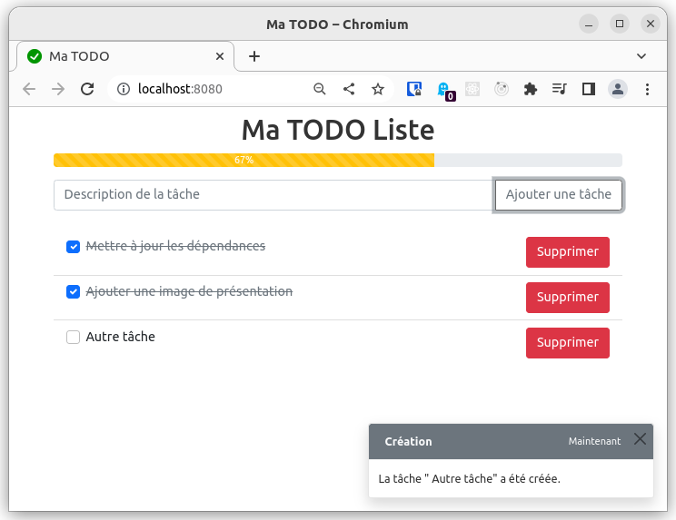

# todo

A simple todo list app to practice [Goland](https://go.dev/) with a [Svelte](https://svelte.dev/) frontend.



## build
```
docker-compose build
```

## run
```
docker-compose run -d
```

[http://localhost:8080/](http://localhost:8080/)